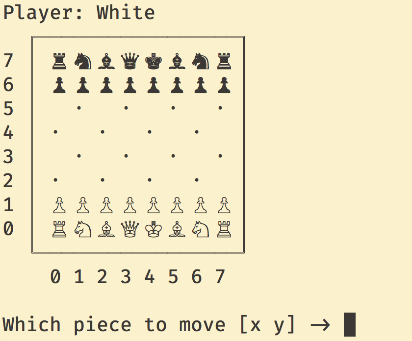

# Chess AI

A rudimentary, simple, and hopefully easy to understand chess engine.



## Features (or Lack Thereof)

* Board and gameplay are pretty-printed
* Human vs. Computer and Computer vs. Computer games can be played/observed
* Pre-initialized boards from strings can be passed in
* Evaluates using piece value and positional reasoning
* Castling, en passant, and pawn promotions are NOT handled

## Development

* [ ] Handle castling, en passant, and pawn promotion
* [ ] Correctly profile move evalution code, logic, and functions
* [ ] Clean up move generation code (maybe?)
* [ ] Clean up positional reasoning code
* [x] ~~Create a game manager that handles two-player games~~
* [x] ~~Allow passing in initial board configs as strings to be automatically converted~~
* [x] ~~Use a smarter board-heuristic based on move instead of recalculating for whole board~~

## Installation

1. Clone / download this repository.
2. Run the `src/main.py` file with Python 3 to quickly play a game against the engine.

## Usage

The primary interface will be `GameManager` or `ChessGame` which allows for game creation and management.

Note that colors are represented as follows:
  * `white = 10`
  * `black = 20`

#### Playing a Human vs. Computer Game

```python3
import GameManager

game = GameManager.HumanvAIGame(10)   # Human player is white

game.play()   # Will play an interactive game in the CLI
```

#### Observing Computer vs. Computer Game

```python3

# Initialize with different "difficulty" levels (max game-tree evaluation)
game = GameManager.AIvAIGame(whiteMaxDepth=2, blackMaxDepth=3)

# Play one computer move each
game.playOneMove()

# Play 7 computer moves each, supressing board output
game.playNMove(7, printBoards=False)

# Play against each other until game finished, printing boards and move choices
game.playUntilDone(printStuff=True)
```

#### Multiple Computer vs. Computer Game Statistics

```python3
game = GameManager.AIvAIGame(whiteMaxDepth=2, blackMaxDepth=3)

# Play 20 entire games from start to finish, displaying win/loss statistics once completed
# Warning, can be very slow if choosing moves takes a while (if maxDepth is high)
game.playNTimes(20)
```

#### Generating Move from Pre-Initialized Board

```python3
import ChessGame

player = 20   # Set active player for this ChessGame view as black

# Create initial board configuration as a string, {upper-case: white, lower-case: black, dash: empty}
# Only requirement is that it MUST contain two opposing kings
board = ('r n - q k b n -'
         '- p - p p p p p'
         'b - - - - - - r'
         '- - - - - - - -'
         '- - - P - - Q -'
         'P - - - - - - -'
         '- P P - P - P P'
         'R - B - K - N -')

# Create game, passing in active player and initial board string
game = ChessGame.ChessGame(player, initBoard=board)

# Find best move, searching game-tree 3 levels deep
bestMove = game.getMove(maxDepth=3)

# Make the found best move, changing current board state
game.makeMove(bestMove)

# Pretty print current game board
print(game)
```

